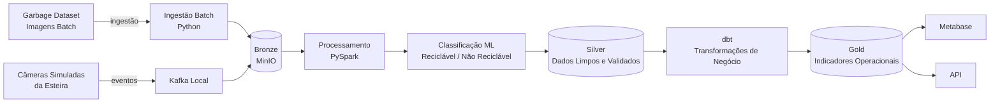

# EcoSort — Protótipo de Ciclo de Vida de Engenharia de Dados

> Classificação Inteligente de Resíduos Urbanos

**Integrantes:**
- Leonardo Amaral — Matrícula: XXXXXXX
- Tatiana Hanada — Matrícula: 22301398

---

## Sobre o Projeto

O EcoSort é um protótipo de ciclo de vida de engenharia de dados voltado para a classificação automática de resíduos sólidos em recicláveis e não recicláveis, com o objetivo de apoiar operações de coleta seletiva em municípios ou cooperativas de triagem.

A partir de imagens de resíduos domésticos, o pipeline processa, classifica e gera indicadores operacionais para gestores de coleta, utilizando uma arquitetura Lakehouse com padrão Medalhão (Bronze → Silver → Gold).

---

## Estrutura do Repositório

```
ecosort/
│
├── README.md
└── docs/
    ├── 01-descricao-projeto.md
    ├── 02-definicao-dados.md
    ├── 03-dominios-servicos.md
    ├── 04-arquitetura.md
    ├── 05-tecnologias.md
    └── 06-consideracoes-finais.md
```

---

## Navegação Rápida

| Documento | Conteúdo |
|---|---|
| [01 - Descrição do Projeto](docs/01-descricao-projeto.md) | Contexto, problema, stakeholders |
| [02 - Definição dos Dados](docs/02-definicao-dados.md) | Fontes, formatos, classificação batch/streaming |
| [03 - Domínios e Serviços](docs/03-dominios-servicos.md) | Domínios de negócio e responsabilidades |
| [04 - Arquitetura](docs/04-arquitetura.md) | Fluxo de dados ponta a ponta, diagramas |
| [05 - Tecnologias](docs/05-tecnologias.md) | Stack escolhida e justificativas |
| [06 - Considerações Finais](docs/06-consideracoes-finais.md) | Riscos, limitações e próximos passos |

---

## Fluxo de Dados




## Stack Tecnológica

| Etapa | Tecnologia |
|---|---|
| Ingestão Batch | Python |
| Ingestão Streaming | Apache Kafka (local) |
| Armazenamento | MinIO + Delta Lake / Apache Iceberg |
| Processamento | PySpark |
| Qualidade de Dados | Great Expectations |
| Transformação Analítica | dbt |
| Orquestração | Prefect ou Airflow |
| Consumo | Metabase + API |

> Toda a stack roda localmente via **Docker Compose**, sem dependência de serviços em nuvem pagos.
