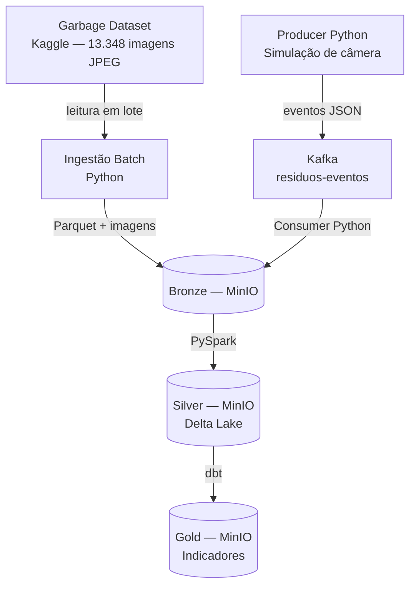

# 02 — Definição e Classificação dos Dados

## Fonte de Dados

O projeto utiliza como única fonte primária real o Garbage Dataset, disponível publicamente no [Kaggle](https://www.kaggle.com/datasets/sumn2u/garbage-classification-v2) contendo 13.348 imagens divididas em 10 classes de resíduos domésticos.

Todos os metadados e eventos de streaming são gerados sinteticamente pelo próprio pipeline, o que é explicitamente documentado como prática comum em protótipos de engenharia de dados.

---

## Classificação dos Dados

### Dados Operacionais — Batch

| Atributo | Detalhe |
|---|---|
| Origem | Garbage Dataset (Kaggle) |
| Formato | Imagens JPEG/PNG organizadas em subpastas por classe |
| Volume | ~13.348 arquivos de imagem |
| Periodicidade | Ingestão única (histórico) + re-ingestão simulando novos lotes por turno |
| Latência esperada | Alta — processamento em lote, sem exigência de tempo real |
| Metadados gerados | `image_id`, `class_label`, `recyclable` (booleano), `file_size_kb`, `ingestion_timestamp`, `batch_id` |

O caminho batch representa o processamento do acervo completo de imagens — equivalente a um sistema que recebe um lote de fotos ao final de cada turno de triagem.

### Dados de Streaming — Eventos Simulados

| Atributo | Detalhe |
|---|---|
| Origem | Producer Python simulando câmeras de esteira |
| Formato | JSON via Apache Kafka |
| Volume | N eventos/segundo (configurável na simulação) |
| Periodicidade | Contínua durante a execução da simulação |
| Latência esperada | Baixa — < 1 segundo por evento |

Estrutura do evento Kafka (JSON):

```json
{
  "event_id": "uuid-v4",
  "camera_id": "CAM-03",
  "timestamp": "2025-10-15T14:32:01.123Z",
  "image_path": "plastic/img_0042.jpg",
  "predicted_class": "Plastic",
  "recyclable": true,
  "confidence": 0.91
}
```

O producer sorteia imagens do dataset e publica eventos no tópico Kafka `residuos-eventos`, simulando câmeras em operação contínua.

---

## Camadas de Armazenamento

| Camada | Conteúdo | Formato |
|---|---|---|
| Bronze | Dados brutos: metadados de ingestão + eventos Kafka sem modificação | Parquet + JPEG original |
| Silver | Dados limpos, validados (Great Expectations), `recyclable` calculado, deduplicados | Delta Lake, particionado por `class_label` |
| Gold | Indicadores de negócio: totais por classe, taxa de reciclabilidade, série temporal | Delta Lake |

---

## Diagrama das Fontes


```
