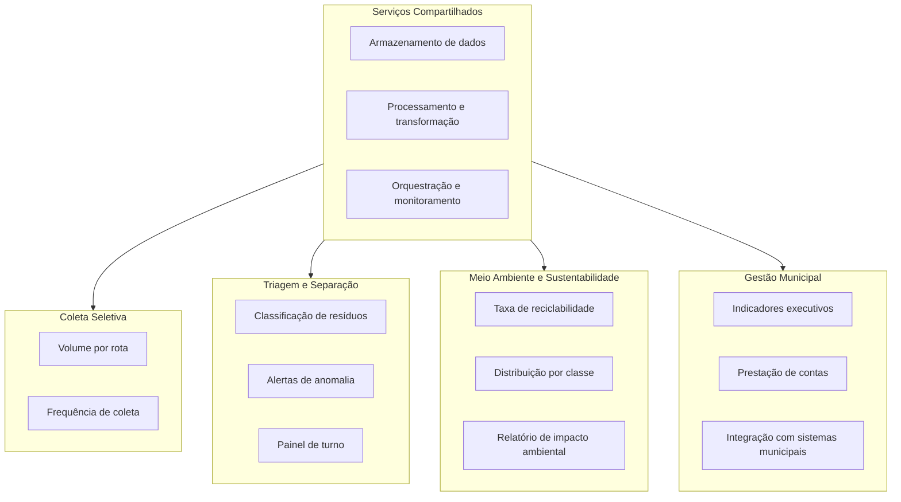

# 03 — Domínios e Serviços

## Contexto de Negócio

O EcoSort seria implantado em uma prefeitura ou cooperativa de triagem de resíduos urbanos. A organização é dividida em quatro domínios de negócio, cada um com seus próprios usuários, necessidades e forma de consumir os dados gerados pelo pipeline.

---

## Domínios de Negócio

### 1. Coleta Seletiva

Setor: Equipes de coleta de resíduos e logística de rotas

Quem usa: Agentes de coleta, motoristas, coordenadores de rota

Para quê: Entender quais regiões e rotas geram maior volume de material reciclável, otimizando a frequência e o trajeto das coletas.

Como o EcoSort serve esse domínio:
- Dados agregados por ponto de coleta e turno (camada Gold)

| Serviço de Dados | Descrição |
|---|---|
| Volume por rota | Quantidade de itens recicláveis e não recicláveis registrados por ponto de origem |
| Frequência de coleta | Indicador para ajustar a periodicidade das rotas com base no volume histórico |

---

### 2. Triagem e Separação

Setor: Operação das esteiras de separação de resíduos

Quem usa: Operadores de esteira, supervisores de turno

Para quê: Acompanhar em tempo real a classificação dos resíduos que passam pela esteira, identificar anomalias e garantir a eficiência da separação.

Como o EcoSort serve esse domínio:
- Eventos de classificação em tempo real via streaming (Kafka)
- Alertas quando uma categoria fora do padrão é detectada
- Painel operacional com volume classificado por turno (Metabase)

| Serviço de Dados | Descrição |
|---|---|
| Classificação em tempo real | Cada item é classificado como reciclável ou não reciclável ao passar pela câmera |
| Painel de turno | Resumo do volume processado, taxa de reciclabilidade e alertas do turno atual |

---

### 3. Meio Ambiente e Sustentabilidade

Setor: Área técnica responsável por indicadores ambientais e metas de sustentabilidade

Quem usa: Analistas ambientais, técnicos de resíduos sólidos

Para quê: Medir a taxa de reciclabilidade ao longo do tempo, gerar relatórios de impacto ambiental e acompanhar o cumprimento de metas estabelecidas pela legislação ou por acordos municipais.

Como o EcoSort serve esse domínio:
- Série histórica de classificações por classe de resíduo (camada Gold)
- Taxa de reciclabilidade por período disponível no dashboard
- Relatórios exportáveis para prestação de contas

| Serviço de Dados | Descrição |
|---|---|
| Taxa de reciclabilidade | Percentual de itens recicláveis sobre o total processado por dia, semana ou mês |
| Distribuição por classe | Volume de cada categoria (Metal, Plástico, Vidro, etc.) ao longo do tempo |
| Relatório de impacto | Dados consolidados para relatórios de sustentabilidade e conformidade legal |

---

### 4. Gestão Municipal

Setor: Secretaria de meio ambiente ou empresa concessionária responsável pelo serviço

Quem usa: Gestores, secretários, diretores

Para quê: Tomar decisões estratégicas sobre investimentos em infraestrutura, definição de metas, renovação de contratos e prestação de contas à população.

Como o EcoSort serve esse domínio:
- Dashboard executivo com indicadores consolidados (Metabase)

| Serviço de Dados | Descrição |
|---|---|
| Indicadores executivos | Taxa de reciclabilidade geral, evolução mensal, comparativo entre períodos |
| Integração externa | Exposição dos dados via API para sistemas de gestão municipal |

---

## Serviços Compartilhados entre Domínios

| Serviço | Usado por |
|---|---|
| Armazenamento (MinIO — Bronze, Silver, Gold) | Todos os domínios |
| Processamento (PySpark) | Triagem e Separação, Meio Ambiente |
| Orquestração (Prefect) | Todos os domínios — garante que os dados estejam sempre atualizados |
| Monitoramento (Prefect UI + GE Data Docs) | Triagem e Separação, Meio Ambiente |

---

## Diagrama de Domínios e Serviços

