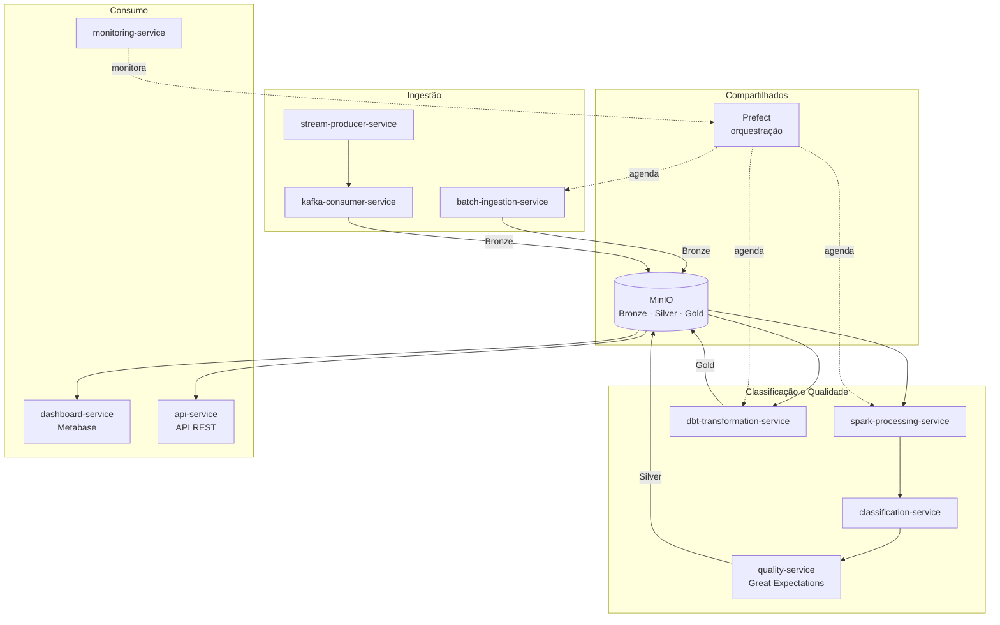
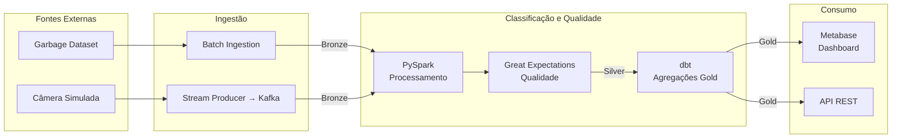

# 03 — Domínios e Serviços

## Domínios de Negócio

O projeto é organizado em três domínios principais, refletindo o fluxo ponta a ponta do pipeline:

---

### 1. Domínio de Ingestão

Responsabilidade: Capturar e registrar todos os dados de entrada — acervo histórico de imagens (batch) e eventos simulados das câmeras (streaming).

| Serviço | Responsabilidade |
|---|---|
| `batch-ingestion-service` | Lê as imagens do Garbage Dataset, gera metadados sintéticos e persiste na camada Bronze |
| `stream-producer-service` | Simula câmeras de esteira publicando eventos JSON no Kafka |
| `kafka-consumer-service` | Consome o tópico `residuos-eventos` e persiste os eventos na camada Bronze |

---

### 2. Domínio de Classificação e Qualidade

Responsabilidade: Processar os dados brutos, garantir qualidade, aplicar as regras de negócio e transformar os dados para Silver e Gold.

| Serviço | Responsabilidade |
|---|---|
| `spark-processing-service` | Lê a Bronze, executa limpeza e deduplicação via PySpark |
| `classification-service` | Aplica a regra de negócio: `class_label` → `recyclable` (booleano) |
| `quality-service` | Valida os dados com Great Expectations antes de promover para Silver |
| `dbt-transformation-service` | Gera os modelos analíticos na camada Gold (agregações de negócio) |

---

### 3. Domínio de Consumo

Responsabilidade: Disponibilizar os dados processados para usuários finais e sistemas externos.

| Serviço | Responsabilidade |
|---|---|
| `dashboard-service` | Conecta a camada Gold ao Metabase para visualização pelos gestores |
| `api-service` | Expõe os indicadores Gold via API REST para integração com sistemas externos |
| `monitoring-service` | Monitora a saúde do pipeline (Prefect UI + logs) |

---

### Serviços Compartilhados

| Serviço | Usado por |
|---|---|
| `storage-service` (MinIO) | Todos os domínios — armazena Bronze, Silver e Gold |
| `orchestration-service` (Prefect) | Ingestão e Classificação — agenda e monitora os jobs |

---

## Diagrama de Domínios e Serviços

---

## Fluxo entre Domínios

