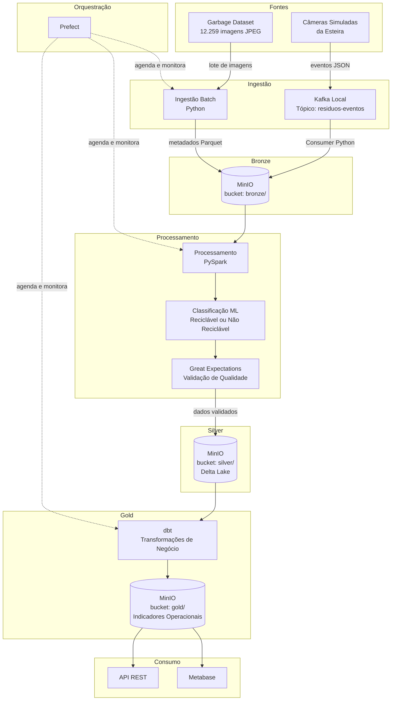

# 04 — Arquitetura e Fluxo de Dados

## Tipo de Arquitetura Escolhida

### Lakehouse com Padrão Medalhão (Bronze → Silver → Gold)

A arquitetura escolhida é um Lakehouse com organização em camadas Medalhão, executado localmente via Docker Compose.

Por que Lakehouse?
O projeto lida simultaneamente com dados não-estruturados (imagens JPEG) e estruturados (metadados e eventos gerados pelo pipeline). Um Data Warehouse tradicional não consegue armazenar imagens. Um Data Lake puro dificultaria a governança e a qualidade dos dados. O Lakehouse combina os dois: armazena qualquer tipo de dado (como o Data Lake) mas adiciona estrutura, qualidade e rastreabilidade nas camadas superiores (como o Data Warehouse), especialmente com o uso de Delta Lake nas camadas Silver e Gold.

Por que Medalhão?
O padrão Medalhão separa claramente as responsabilidades de cada etapa:
- Bronze: dados brutos, sem modificação — preservados para reprocessamento a qualquer momento
- Silver: dados limpos, validados (Great Expectations) e classificados (reciclável × não reciclável)
- Gold: indicadores de negócio prontos para consumo — dashboards e API

Essa separação garante reversibilidade: se uma regra de negócio mudar, basta reprocessar da Bronze sem perda de dados.

Por que não Lambda ou Kappa?

- Lambda exigiria manter duas versões do código (batch e streaming separados) — desnecessário para o escopo do protótipo.
- Kappa (somente streaming) eliminaria o caminho batch, que é central para o processamento do dataset histórico.
- O Lakehouse com Medalhão absorve os dois caminhos na mesma camada Bronze de forma simples e viável.

---

## Fluxo de Dados — Ponta a Ponta



---

## Caminhos Batch e Streaming

### Caminho Batch

```
Garbage Dataset (JPEG)
  → Script Python (gera metadados sintéticos)
    → MinIO Bronze (Parquet)
      → PySpark (limpeza + classificação)
        → Great Expectations (validação)
          → MinIO Silver (Delta Lake)
            → dbt (agregações)
              → MinIO Gold
                → Metabase / API
```

- Acionado pelo Prefect via flow agendado
- Representa o processamento do acervo histórico ou de novos lotes ao final de cada turno

### Caminho Streaming

```
Producer Python (sorteia imagens + gera evento JSON)
  → Kafka Topic: residuos-eventos
    → Kafka Consumer (Python)
      → MinIO Bronze
        → (mesmo pipeline batch a partir daqui)
```

- Producer roda de forma contínua, simulando câmeras em operação
- Os eventos chegam na Bronze e seguem o mesmo pipeline de processamento

---

## Diagrama das Camadas Medalhão

```mermaid
graph LR
    subgraph Bronze
        BR1[Imagens JPEG originais]
        BR2[Metadados brutos — Parquet]
        BR3[Eventos Kafka — JSON → Parquet]
    end

    subgraph Silver
        SI1[Dados limpos e deduplicados]
        SI2[Campo recyclable calculado]
        SI3[Validado pelo Great Expectations]
        SI4[Particionado por class_label]
    end

    subgraph Gold
        GO1[Total por classe]
        GO2[Taxa de reciclabilidade %]
        GO3[Volume por turno simulado]
        GO4[Série temporal de eventos]
    end

    Bronze -->|PySpark + GE| Silver
    Silver -->|dbt| Gold
```



---

## Trade-offs da Arquitetura

| Dimensão | Decisão | Trade-off |
|---|---|---|
| Acoplamento | Kafka desacopla producer e consumer | Adiciona complexidade operacional; justificado por representar uma arquitetura real de streaming |
| Escalabilidade | MinIO + Delta Lake escalam horizontalmente | Para o protótipo local o volume é pequeno; a estrutura já está pronta para crescer |
| Disponibilidade | Docker Compose local, sem redundância | Aceitável para protótipo; em produção exigiria replicação e alta disponibilidade |
| Reversibilidade | Bronze preserva dados brutos sem modificação | Permite reprocessar Silver e Gold a qualquer momento sem perda de dados |
| Confiabilidade | Prefect com retry automático | Flows com retry automático cobrem falhas transitórias; Great Expectations bloqueia dados inválidos |
| Qualidade | Great Expectations na transição Bronze → Silver | Garante que dados inválidos não contaminem as camadas analíticas |
