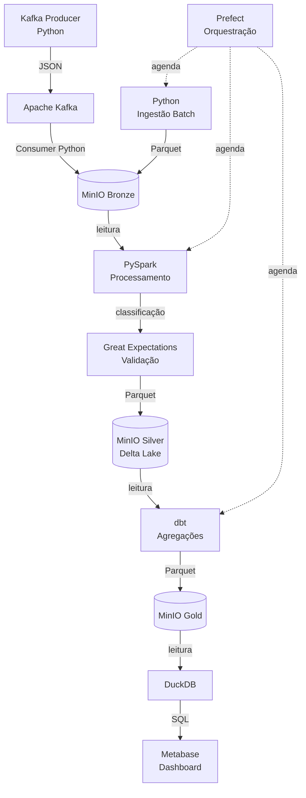

# 05 — Tecnologias

## Visão Geral da Stack

Toda a stack é executada localmente via **Docker Compose**, sem dependência de serviços em nuvem pagos. A escolha por ferramentas open-source é intencional: permite que o projeto rode em qualquer máquina do laboratório e que a Parte 2 (implementação) seja viável sem custos adicionais.

---

## 1. Ingestão Batch — Python

Tecnologia: Python (`os`, `pathlib`, `uuid`, `pandas`, `pyarrow`)

Por que Python:
O Garbage Dataset é uma pasta local de imagens. Ferramentas de integração como Airbyte ou Fivetran são voltadas para conectar sistemas externos (bancos, APIs SaaS) — desnecessário aqui. Um script Python é suficiente, simples e direto ao ponto para o escopo do projeto.

O que o script faz:
- Percorre as subpastas do dataset por classe
- Para cada imagem, gera um registro com: `image_id`, `class_label`, `recyclable`, `file_name`, `file_size_kb`, `ingestion_timestamp`, `batch_id`
- Persiste os metadados em Parquet na camada Bronze do MinIO
- Copia as imagens originais para o bucket Bronze sem modificação

---

## 2. Ingestão Streaming — Apache Kafka (local, Docker)

Tecnologia: Apache Kafka + Producer/Consumer em Python (`kafka-python`)

Por que Kafka:
Kafka é o padrão de mercado para ingestão de eventos em streaming. Ele desacopla completamente o produtor (câmera/simulador) do consumidor (pipeline), garantindo que eventos não sejam perdidos mesmo que o consumer esteja temporariamente indisponível. O Kafka também permite **replay** de mensagens — essencial para reprocessar a Bronze em caso de falha.

Alternativas consideradas:
- **RabbitMQ:** mais simples, mas sem replay de mensagens e persistência limitada
- **Redis Streams:** mais leve, mas menos representativo de uma arquitetura de produção real

Como funciona:
- Producer Python sorteia imagens do dataset e publica eventos JSON no tópico `residuos-eventos`
- Consumer Python consome o tópico e persiste os eventos como Parquet na Bronze

---

## 3. Armazenamento — MinIO + Delta Lake

### MinIO

Por que MinIO:
O MinIO é um object storage open-source totalmente compatível com a API do Amazon S3. O código escrito para o MinIO funciona, sem modificações, com S3 em produção — tornando a migração para nuvem trivial. É a escolha natural para um Lakehouse local.

Organização dos buckets:
```
minio/
├── bronze/    → dados brutos (Parquet de metadados + imagens JPEG)
├── silver/    → dados limpos, classificados e validados
└── gold/      → indicadores de negócio agregados
```

### Delta Lake (Silver e Gold)

Por que Delta Lake:
O Delta Lake é um formato de tabela open-source que adiciona capacidades de banco de dados sobre arquivos Parquet: ACID transactions, time travel (consultar versões anteriores dos dados), schema evolution e suporte a operações de UPDATE/DELETE — essencial na camada Silver, onde dados podem precisar ser corrigidos ou reprocessados sem perda da Bronze.

A escolha do Delta Lake em detrimento do Apache Iceberg se justifica por:

- Integração nativa com PySpark — criado pela Databricks, o mesmo time do Spark; funciona via pacote `delta-spark`, sem configuração extra de catálogo
- Configuração mais simples localmente** — o Iceberg exige configuração elaborada de catálogo (Hive Metastore ou similar); o Delta Lake funciona diretamente sobre o MinIO
- Documentação abundante — a combinação PySpark + Delta Lake é amplamente documentada; mais fácil encontrar referências e resolver problemas
- Ecossistema coerente — toda a stack já usa o ecossistema Spark/Python; Delta Lake se encaixa naturalmente

O Iceberg seria mais adequado em ambientes multi-engine (Spark + Flink + Trino) ou com catálogos gerenciados em nuvem. Para um protótipo local com PySpark, Delta Lake é a escolha mais pragmática.

---

## 4. Processamento — PySpark

Tecnologia: Apache Spark (PySpark), rodando em modo `local[*]` via Docker

Por que PySpark:
O Spark é a ferramenta padrão para processamento distribuído de dados. Para o protótipo, o volume de 13k imagens não exige distribuição — mas o uso do PySpark demonstra a arquitetura correta para um sistema que, em produção, processaria milhões de eventos. O modo `local[*]` permite rodar sem cluster, consumindo apenas os recursos da máquina local.

O que o Spark faz (Bronze → Silver):
- Lê os Parquets da Bronze
- Remove duplicatas (eventos que possam ter chegado mais de uma vez via Kafka)
- Aplica a regra de classificação: `recyclable = class_label in ['Metal', 'Glass', 'Paper', 'Cardboard', 'Plastic']`
- Valida campos obrigatórios
- Escreve o resultado em Delta Lake na Silver, particionado por `class_label`

---

## 5. Qualidade de Dados — Great Expectations

Tecnologia: Great Expectations (`great_expectations`)

Por que Great Expectations:
Great Expectations é a biblioteca padrão de validação de dados em Python. Permite definir "expectativas" sobre os dados (ex.: `class_label` não pode ser nulo, `recyclable` deve ser booleano, `confidence` deve estar entre 0 e 1) e executar essas validações automaticamente no pipeline. Se os dados não passarem nas validações, o pipeline é interrompido antes de promover dados inválidos para a Silver.

Onde entra no pipeline:
Entre o processamento PySpark e a escrita na Silver — funciona como um "portão de qualidade".

---

## 6. Transformação Analítica — dbt

Tecnologia: dbt (data build tool)

Por que dbt:
O dbt é a ferramenta padrão para transformações analíticas em SQL. Transforma a camada Silver em modelos prontos para consumo (Gold), com versionamento, testes automáticos de qualidade (`not_null`, `accepted_values`) e documentação gerada automaticamente. Amplamente adotado no mercado, demonstra boas práticas de DataOps.

Modelos dbt planejados:
- `fct_residuos_por_classe` — contagem total por `class_label`
- `fct_taxa_reciclabilidade` — percentual de recicláveis sobre o total
- `fct_volume_por_turno` — volume de itens por `turno_simulado`
- `fct_serie_temporal` — eventos ao longo do tempo (baseado no streaming)

---

## 7. Orquestração — Prefect

Tecnologia: Prefect

Por que Prefect e não Airflow:
O Prefect é um orquestrador moderno de pipelines de dados. Para o contexto deste protótipo, ele é mais adequado que o Airflow pelos seguintes motivos:

- Mais leve localmente: o Airflow exige banco de dados (PostgreSQL/SQLite), scheduler, webserver e worker rodando como processos separados; o Prefect sobe com um único processo, reduzindo o consumo de recursos da máquina — importante dado que a stack já inclui Kafka, Spark, MinIO, DuckDB e Metabase
- Python puro: os flows são definidos como funções Python decoradas com `@flow` e `@task`, sem necessidade de escrever DAGs em YAML ou XML
- Curva de aprendizado menor: mais simples de configurar, depurar e apresentar
- Docker mais leve: a imagem oficial do Airflow é significativamente maior que a do Prefect

O Airflow seria a escolha mais adequada em um ambiente de produção corporativo, onde seu ecossistema maduro de conectores e operadores justifica o custo operacional adicional. Para um protótipo local, o Prefect é mais pragmático.

**Flows planejados:**
- `flow_batch_ingestion` — aciona o script Python de ingestão batch
- `flow_spark_transform` — executa o job PySpark (Bronze → Silver) após a ingestão
- `flow_dbt_gold` — executa os modelos dbt após o Spark (Silver → Gold)

---

## 8. Consumo — DuckDB + Metabase

### DuckDB — camada intermediária

Por que DuckDB:
O Metabase na versão open-source não consegue ler arquivos Parquet ou Delta Lake diretamente — ele precisa de um banco de dados SQL. O DuckDB resolve esse problema: é um banco de dados analítico leve, embutido (sem servidor separado), capaz de ler arquivos Parquet e Delta Lake do MinIO como se fossem tabelas SQL nativas.

Na prática, o DuckDB serve de ponte entre a camada Gold e o Metabase:

```
Gold (MinIO / Delta Lake) → DuckDB → Metabase
```

Além disso, o DuckDB é extremamente leve — roda como uma biblioteca Python, sem precisar de um container extra no Docker Compose — o que não adiciona carga à máquina local.

### Metabase

Por que Metabase:
Ferramenta de BI open-source que permite criar dashboards sem escrever código, ideal para o perfil dos stakeholders (gestores sem background técnico). Roda via Docker e conecta a fontes de dados estruturadas.

Dashboards planejados:
- Distribuição de resíduos por classe (gráfico de barras)
- Taxa de reciclabilidade geral e por turno (gauge + linha do tempo)
- Volume de eventos de streaming ao longo do tempo
- Alertas para classes fora do padrão esperado


---

## 9. Correntes do Ciclo de Vida

| Dimensão | Abordagem no Protótipo |
|---|---|
| Segurança | Credenciais via variáveis de ambiente (`.env`); sem senhas expostas no repositório |
| Qualidade de dados | Great Expectations na Bronze → Silver; testes dbt na Silver → Gold |
| Governança | Documentação gerada pelo dbt (`dbt docs generate`); dicionário de dados no README |
| Monitoramento | Prefect UI para flows; logs de cada etapa persistidos |
| DataOps| Repositório versionado no GitHub; `docker-compose.yml` como infraestrutura como código |

---

## Resumo da Stack



---

## Integração via Docker Compose

```yaml
services:
  zookeeper:      # necessário para o Kafka
  kafka:          # broker de mensagens (streaming)
  minio:          # object storage local (S3-compatible)
  spark:          # processamento PySpark
  prefect:        # orquestração
  metabase:       # dashboard para gestores
```

O ambiente completo pode ser iniciado com um único comando:

```bash
docker compose up
```

---

## 10. Monitoramento — Prefect UI + Great Expectations Data Docs

O monitoramento do EcoSort é coberto por duas ferramentas já presentes na stack, sem necessidade de adicionar serviços extras:

### Prefect UI — saúde do pipeline

O Prefect inclui uma interface web nativa que permite acompanhar em tempo real:

- Status de cada flow (sucesso, falha, em execução)
- Histórico de execuções e duração de cada etapa
- Logs detalhados por task
- Retry automático em caso de falha

É a camada de monitoramento operacional do pipeline — equivalente ao que o Grafana faria, mas sem precisar configurar Prometheus ou exporters adicionais.

### Great Expectations Data Docs — saúde dos dados

O Great Expectations gera automaticamente um site estático (Data Docs) após cada execução de validação, contendo:

- Resultado de cada expectativa por coluna (passou / falhou)
- Percentual de registros válidos por execução
- Histórico de qualidade ao longo do tempo

É a camada de monitoramento da qualidade dos dados — garante que problemas nos dados sejam detectados antes de contaminar as camadas Silver e Gold.

### Por que não Grafana?

O Grafana seria a escolha ideal em produção, pois centraliza métricas de infraestrutura (CPU, memória, Kafka lag, Spark jobs) em dashboards unificados. No entanto, exige a configuração adicional do Prometheus como coletor de métricas e exporters para cada serviço — o que aumentaria significativamente a complexidade do `docker-compose.yml` local. Para o protótipo, o Prefect UI + GE Data Docs cobre as necessidades de observabilidade com zero configuração extra. O Grafana é documentado como evolução natural para a Parte 2 ou para um ambiente de produção.
