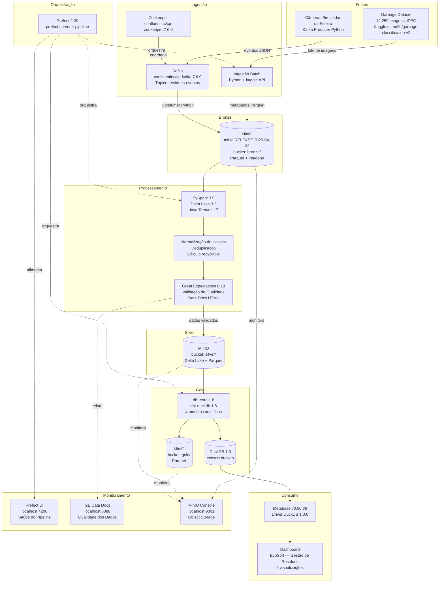

# EcoSort — Arquitetura Funcional Docker

## Objetivo

Entregar um protótipo executável de engenharia de dados para classificar resíduos domésticos em recicláveis e não recicláveis, armazenar dados em arquitetura Lakehouse com padrão Medalhão e disponibilizar indicadores para consumo analítico.

## Fontes

1. **Batch real**: dataset Kaggle `sumn2u/garbage-classification-v2`.
2. **Streaming simulado**: eventos JSON publicados no Kafka a partir de amostras do dataset.

## Camadas

### Bronze

Camada bruta, sem regra de negócio destrutiva.

Conteúdo:
- Metadados batch em Parquet.
- Imagens originais copiadas do dataset.
- Eventos Kafka consumidos como Parquet.

Destino:
- Sistema local: `data/lakehouse/bronze`
- Object storage: MinIO bucket `bronze`

### Silver

Camada limpa, deduplicada e validada.

Conteúdo:
- Classe normalizada.
- Campo `recyclable` calculado.
- Confiança padronizada.
- Origem batch/streaming.
- Particionamento por classe.

Destino:
- Delta Lake: `data/lakehouse/silver/delta/residuos`
- Export Parquet para dbt/DuckDB: `data/lakehouse/silver/parquet/residuos`
- MinIO bucket `silver`

### Gold

Camada de indicadores de negócio.

Modelos:
- `fct_residuos_por_classe`
- `fct_taxa_reciclabilidade`
- `fct_volume_por_turno`
- `fct_serie_temporal`

Destino:
- DuckDB: `data/duckdb/ecosort.duckdb`
- Parquet: `data/lakehouse/gold/parquet`
- MinIO bucket `gold`

## Serviços Docker

| Serviço | Imagem | Papel |
|---|---|---|
| `zookeeper` | `confluentinc/cp-zookeeper:7.6.0` | Coordenação do Kafka |
| `kafka` | `confluentinc/cp-kafka:7.6.0` | Broker para eventos de streaming |
| `minio` | `minio/minio:RELEASE.2025-04-22T22-12-26Z` | Object storage local S3-compatible |
| `minio-init` | `minio/mc:RELEASE.2025-04-16T18-13-26Z` | Criação automática dos buckets |
| `prefect-server` | imagem local (Python 3.11 + Temurin 17) | UI/API de orquestração |
| `pipeline` | imagem local (Python 3.11 + Temurin 17) | Execução automática do fluxo principal |
| `ge-docs` | `nginx:1.27-alpine` | Servidor estático dos Data Docs |
| `metabase` | `metabase/metabase:v0.50.36` + driver DuckDB 1.0.0 | Dashboard BI com driver DuckDB |
| `kafka-producer` | imagem local (Python 3.11 + Temurin 17) | Producer opcional contínuo |
| `kafka-consumer` | imagem local (Python 3.11 + Temurin 17) | Consumer opcional contínuo |

> As imagens locais são construídas a partir do `Dockerfile` na raiz do projeto, baseado em `python:3.11-slim` com Java **Temurin 17** (Adoptium), necessário para compatibilidade com PySpark 3.5 e Delta Lake 3.2.

## Dashboard BI

O Metabase disponibiliza o dashboard **EcoSort — Gestão de Resíduos** com os seguintes indicadores:

| Visualização | Fonte | Tipo |
|---|---|---|
| Taxa de Reciclabilidade | `fct_taxa_reciclabilidade` | Número (%) |
| Total de Itens Processados | `fct_taxa_reciclabilidade` | Número |
| Total de Recicláveis | `fct_taxa_reciclabilidade` | Número |
| Volume por Turno | `fct_volume_por_turno` | Gráfico de barras |
| Resíduos por Classe | `fct_residuos_por_classe` | Gráfico de barras |
| Série Temporal | `fct_serie_temporal` | Gráfico de linha |

## Diagrama As-Built

O diagrama abaixo reflete a arquitetura **efetivamente implementada e validada** em execução local via Docker Compose.

## Relatório de Mudanças (As-Built)

Esta seção documenta as diferenças entre a arquitetura planejada na Parte 1 e a arquitetura efetivamente implementada, com justificativas técnicas.

### 1. Kafka e Zookeeper — troca de imagem

**Planejado:** `bitnami/kafka:3.7` e `bitnami/zookeeper:3.9`

**Implementado:** `confluentinc/cp-kafka:7.6.0` e `confluentinc/cp-zookeeper:7.6.0`

**Justificativa:** As imagens Bitnami nas versões especificadas foram descontinuadas e removidas do Docker Hub durante o período de implementação. A Confluent Platform é a distribuição de referência do Apache Kafka, com suporte ativo e compatibilidade equivalente. A migração exigiu ajuste das variáveis de ambiente (`KAFKA_ZOOKEEPER_CONNECT`, `KAFKA_LISTENERS`) e do healthcheck (`kafka-topics` sem extensão `.sh`).

### 2. Java — troca de pacote

**Planejado:** `openjdk-17-jre-headless` (repositório Debian padrão)

**Implementado:** `temurin-17-jdk` (Adoptium via repositório externo)

**Justificativa:** O pacote `openjdk-17-jre-headless` não estava disponível nos repositórios do `python:3.11-slim` (Debian Bookworm). O Temurin 17 da Adoptium é a distribuição OpenJDK mais amplamente recomendada para ambientes de produção, com suporte de longo prazo (LTS) e compatibilidade total com PySpark 3.5 e Delta Lake 3.2.

### 3. Metabase — versão fixada

**Planejado:** `metabase/metabase:latest`

**Implementado:** `metabase/metabase:v0.50.36`

**Justificativa:** A versão `latest` do Metabase no momento da implementação era a v0.62, que usa Java 21. O driver comunitário DuckDB 1.0.0 é incompatível com Java 21 (`Could not initialize class org.duckdb.DuckDBNative`). A versão v0.50.36 usa Java 17, compatível com o driver, e é uma versão estável com todos os recursos necessários para o projeto. A biblioteca `libstdc++6` também foi adicionada via `apk` (Alpine Linux) para suporte às dependências nativas do DuckDB.

### 4. Volume do Metabase — permissão de escrita

**Planejado:** `./data/duckdb:/data/duckdb:ro` (somente leitura)

**Implementado:** `./data/duckdb:/data/duckdb` (leitura e escrita)

**Justificativa:** O driver DuckDB do Metabase cria arquivos temporários e de lock no mesmo diretório do banco durante a conexão, exigindo permissão de escrita. A montagem em modo somente leitura retornava `Permission denied` ao tentar conectar.

### 5. Dashboard BI — implementação manual no Metabase

**Planejado:** Dashboard disponível automaticamente após o pipeline.

**Implementado:** Dashboard configurado manualmente no primeiro acesso ao Metabase.

**Justificativa:** O Metabase não oferece uma API de provisionamento de dashboards via arquivo de configuração na versão open-source. A configuração da conexão DuckDB e a criação dos 6 gráficos foram realizadas pela interface web e documentadas no README para reprodução.

## Regras de classificação

Recicláveis:
- Metal
- Glass
- Paper
- Cardboard
- Plastic

Não recicláveis no protótipo:
- Biological
- Battery
- Trash
- Shoes
- Clothes

> Baterias são tratadas como não recicláveis no fluxo simplificado, embora na prática exijam descarte especial.
